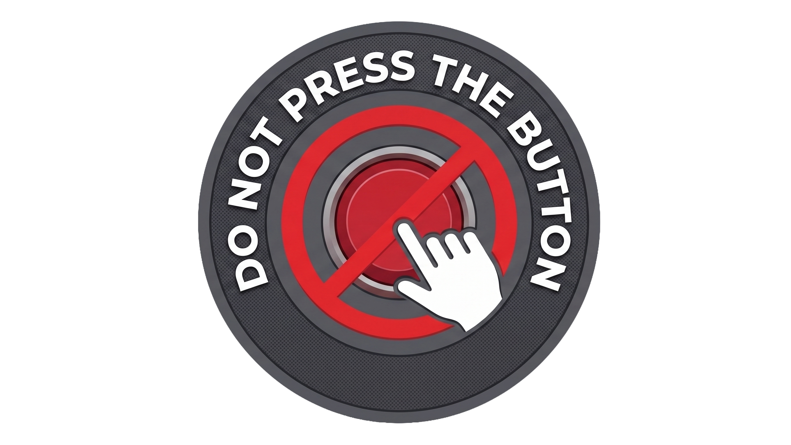

# Don't Press the Button

## Description
**Don't Press the Button** is a browser-based interactive psychological puzzle game where players are challenged to ignore warnings, test their reflexes, and push the limits of their short-term memory. As the game progresses, players encounter unexpected obstacles, decoy buttons, rapid-fire math equations, and humorous dialogue. The objective is to overcome every trick the game throws at you, survive the timer, and unlock the final stage to win.

**Background Info:** I chose to build this game to explore cognitive science concepts—like working memory interference and the "phonological loop"—and wrap them in a fun, unpredictable experience. It messes with the player's expectations, forcing them to juggle remembering a secret number while completing unrelated, high-pressure tasks.

---

## Getting Started

* **Play the Game Here:** [Click here to play Don't Press the Button](https://alialsaeed313.github.io/Don-t-press-the-bottun-game/) 
* **Planning Materials:** [Click here to view my Trello Board](https://trello.com/b/pc0gzvLc/ga-poject-1)

**Instructions:** 
1. Open the game link in any modern web browser.
2. Read the dialogue box carefully.
3. Follow the commands, solve the prompts, and race against the ticking clock. 
4. Whatever you do... obey the button's rules before your time runs out!
5. You can choose the mood you want to, such as light or dark mood.

---

## Technologies Used

* **JavaScript:** Core game logic, state management, timer loops, and the DOM manipulation.
* **HTML:** Semantic structure and layout.
* **CSS:** Custom styling, dark/light mode theming, and layout formatting.

---

## Attributions

* **Sound Engine:** All audio and retro sound effects were synthesized completely from scratch using the native [Web Audio API](https://developer.mozilla.org/en-US/docs/Web/API/Web_Audio_API). No external `.mp3` or `.wav` assets were used.
* **Graphics:** Native emojis (🐀, 🐈) used for game graphics. 
*(Note: Add any other fonts, icons, or guides you used here)*

---

## Next Steps (Future Enhancements)

* Add multiple endings based on player choices and mistakes.
* Save the fastest completion time using the browser's Local Storage.
* Include random events and hidden easter eggs for high replayability.
* Add complex animations and screen-shake visual effects for Game Over states.

---

## User Stories

* As a player, I want to interact with the button and discover how the game changes after every press.
* As a player, I want to overcome the game's tricks and challenges so that I can unlock the final button and win.
* As a player, I want to see my completion time after finishing the game so that I can challenge myself to beat my best time.

---

## Credits

Developed by **Ali Alsaeed**